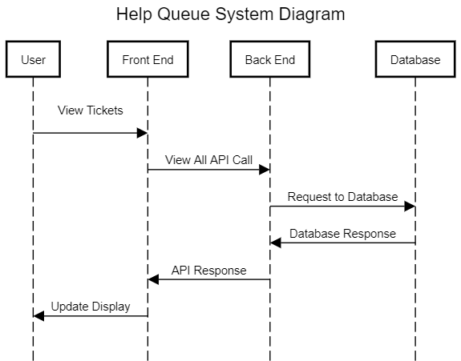
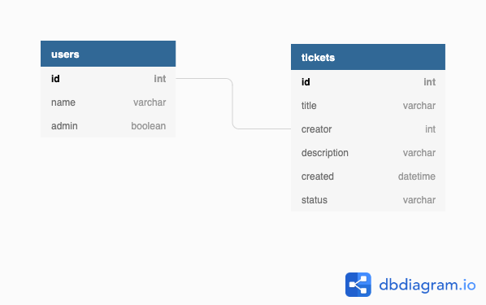
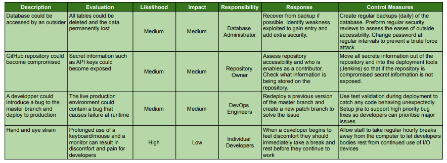

# Help Queue

## Project Outline

This repository contains both the front and back-end code of a program that provides a technical support queue. This project is a training exercise for full stack development. Specifically, this exercise was used to improve my understanding of Java Spring API development and DevOps.

The application allows users to report technical issues they are experiencing and enables admins to update support tickets with solutions.

## JIRA Board

The project managment board can be found at:

https://id.atlassian.com/invite/p/jira-software?id=Jx0Zd3ecSHa_F1vp4H6L4w

(Link may have expired)

## Requirements

* Java 8+
* Maven
* MySQL 8.0+

In addition to this the project uses the following dependencies 

Back-end
* [H2](https://h2database.com) - Embedded DBMS for testing purposes
* [JDBC](https://docs.oracle.com/javase/8/docs/technotes/guides/jdbc/) - Database Management via Java
* [Spring](https://spring.io/) - API and Database Management

Front-end
* [Bootstrap](https://getbootstrap.com/) - CSS Theme Provider

## Installation and Running

Before running the program your MySQL credentials should be entered into the db.properties for local use

## System Lifecycle

## Database Structure

## Risk Assessment

