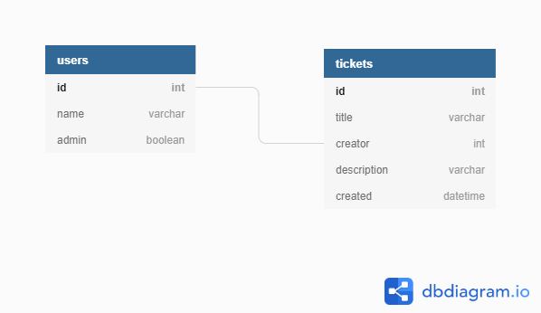

# Help Queue

## Project Outline

This repository contains both the front and back end

## JIRA Board

The project managment board can be found at:

## Requirements

* Java 8+
* Maven (locally installed)
* MySQL 8.0+

In addition to this the project uses the following dependencies 

* [H2](https://h2database.com) - Embedded DBMS for testing
* [JDBC](https://docs.oracle.com/javase/8/docs/technotes/guides/jdbc/) - Database Management via Java
* [JUnit4](https://junit.org/junit4/) - Unit Testing
* [Mockito](https://site.mockito.org/) - Integration Testing
* [Log4J](https://logging.apache.org/log4j/2.x/) - Logging
* https://spring.io/projects/spring-data
* spring web

## Installation and Running

Before running the program your MySQL credentials should be entered into the db.properties

Next start MySQL in a local command line and create the ims database using the command "CREATE DATABASE ims;"

## Testing

## System Lifecycle

## Database Structure

## Database Structure

